# Projects and dependencies analysis

This document provides a comprehensive overview of the projects and their dependencies in the context of upgrading to .NETCoreApp,Version=v10.0.

## Table of Contents

- [Executive Summary](#executive-Summary)
  - [Highlevel Metrics](#highlevel-metrics)
  - [Projects Compatibility](#projects-compatibility)
  - [Package Compatibility](#package-compatibility)
  - [API Compatibility](#api-compatibility)
- [Aggregate NuGet packages details](#aggregate-nuget-packages-details)
- [Top API Migration Challenges](#top-api-migration-challenges)
  - [Technologies and Features](#technologies-and-features)
  - [Most Frequent API Issues](#most-frequent-api-issues)
- [Projects Relationship Graph](#projects-relationship-graph)
- [Project Details](#project-details)

  - [3dRotations\3dSpesifics.csproj](#3drotations3dspesificscsproj)
  - [3DSpesificsUnitTests\3DSpesificsUnitTests.csproj](#3dspesificsunittests3dspesificsunittestscsproj)
  - [3dTesting\Frontend.csproj](#3dtestingfrontendcsproj)
  - [BenchmarkSuite1\BenchmarkSuite.csproj](#benchmarksuite1benchmarksuitecsproj)
  - [BenchmarkSuite4\BenchmarkSuite4.csproj](#benchmarksuite4benchmarksuite4csproj)
  - [BenchmarkSuite5\BenchmarkSuite5.csproj](#benchmarksuite5benchmarksuite5csproj)
  - [CommonUtilities\CommonUtilities.csproj](#commonutilitiescommonutilitiescsproj)
  - [Domain\Domain.csproj](#domaindomaincsproj)
  - [GameAi\GameAiAndControls.csproj](#gameaigameaiandcontrolscsproj)
  - [GameAudio\GameAudio.csproj](#gameaudiogameaudiocsproj)

## Executive Summary

### Highlevel Metrics

| Metric | Count | Status |
| :--- | :---: | :--- |
| Total Projects | 10 | 3 require upgrade |
| Total NuGet Packages | 10 | All compatible |
| Total Code Files | 138 |  |
| Total Code Files with Incidents | 3 |  |
| Total Lines of Code | 26941 |  |
| Total Number of Issues | 3 |  |
| Estimated LOC to modify | 0+ | at least 0,0% of codebase |

### Projects Compatibility

| Project | Target Framework | Difficulty | Package Issues | API Issues | Est. LOC Impact | Description |
| :--- | :---: | :---: | :---: | :---: | :---: | :--- |
| [3dRotations\3dSpesifics.csproj](#3drotations3dspesificscsproj) | net10.0-windows7.0 | ✅ None | 0 | 0 |  | Wpf, Sdk Style = True |
| [3DSpesificsUnitTests\3DSpesificsUnitTests.csproj](#3dspesificsunittests3dspesificsunittestscsproj) | net10.0-windows7.0 | ✅ None | 0 | 0 |  | DotNetCoreApp, Sdk Style = True |
| [3dTesting\Frontend.csproj](#3dtestingfrontendcsproj) | net10.0-windows7.0 | ✅ None | 0 | 0 |  | Wpf, Sdk Style = True |
| [BenchmarkSuite1\BenchmarkSuite.csproj](#benchmarksuite1benchmarksuitecsproj) | net8.0-windows | 🟢 Low | 0 | 0 |  | DotNetCoreApp, Sdk Style = True |
| [BenchmarkSuite4\BenchmarkSuite4.csproj](#benchmarksuite4benchmarksuite4csproj) | net8.0-windows | 🟢 Low | 0 | 0 |  | DotNetCoreApp, Sdk Style = True |
| [BenchmarkSuite5\BenchmarkSuite5.csproj](#benchmarksuite5benchmarksuite5csproj) | net8.0-windows | 🟢 Low | 0 | 0 |  | DotNetCoreApp, Sdk Style = True |
| [CommonUtilities\CommonUtilities.csproj](#commonutilitiescommonutilitiescsproj) | net10.0-windows7.0 | ✅ None | 0 | 0 |  | ClassLibrary, Sdk Style = True |
| [Domain\Domain.csproj](#domaindomaincsproj) | net10.0-windows7.0 | ✅ None | 0 | 0 |  | Wpf, Sdk Style = True |
| [GameAi\GameAiAndControls.csproj](#gameaigameaiandcontrolscsproj) | net10.0-windows7.0 | ✅ None | 0 | 0 |  | Wpf, Sdk Style = True |
| [GameAudio\GameAudio.csproj](#gameaudiogameaudiocsproj) | net10.0-windows7.0 | ✅ None | 0 | 0 |  | ClassLibrary, Sdk Style = True |

### Package Compatibility

| Status | Count | Percentage |
| :--- | :---: | :---: |
| ✅ Compatible | 10 | 100,0% |
| ⚠️ Incompatible | 0 | 0,0% |
| 🔄 Upgrade Recommended | 0 | 0,0% |
| ***Total NuGet Packages*** | ***10*** | ***100%*** |

### API Compatibility

| Category | Count | Impact |
| :--- | :---: | :--- |
| 🔴 Binary Incompatible | 0 | High - Require code changes |
| 🟡 Source Incompatible | 0 | Medium - Needs re-compilation and potential conflicting API error fixing |
| 🔵 Behavioral change | 0 | Low - Behavioral changes that may require testing at runtime |
| ✅ Compatible | 1113 |  |
| ***Total APIs Analyzed*** | ***1113*** |  |

## Aggregate NuGet packages details

| Package | Current Version | Suggested Version | Projects | Description |
| :--- | :---: | :---: | :--- | :--- |
| BenchmarkDotNet | 0.15.2 |  | [BenchmarkSuite.csproj](#benchmarksuite1benchmarksuitecsproj) [BenchmarkSuite4.csproj](#benchmarksuite4benchmarksuite4csproj) [BenchmarkSuite5.csproj](#benchmarksuite5benchmarksuite5csproj) | ✅Compatible |
| coverlet.collector | 6.0.0 |  | [3DSpesificsUnitTests.csproj](#3dspesificsunittests3dspesificsunittestscsproj) | ✅Compatible |
| Microsoft.NET.Test.Sdk | 17.6.0 |  | [3DSpesificsUnitTests.csproj](#3dspesificsunittests3dspesificsunittestscsproj) | ✅Compatible |
| Microsoft.VisualStudio.DiagnosticsHub.BenchmarkDotNetDiagnosers | 18.3.36812.1 |  | [BenchmarkSuite.csproj](#benchmarksuite1benchmarksuitecsproj) [BenchmarkSuite4.csproj](#benchmarksuite4benchmarksuite4csproj) [BenchmarkSuite5.csproj](#benchmarksuite5benchmarksuite5csproj) | ✅Compatible |
| MouseKeyHook | 5.7.1 |  | [CommonUtilities.csproj](#commonutilitiescommonutilitiescsproj) [Domain.csproj](#domaindomaincsproj) [GameAiAndControls.csproj](#gameaigameaiandcontrolscsproj) | ✅Compatible |
| MSTest.TestAdapter | 3.0.4 |  | [3DSpesificsUnitTests.csproj](#3dspesificsunittests3dspesificsunittestscsproj) | ✅Compatible |
| MSTest.TestFramework | 3.0.4 |  | [3DSpesificsUnitTests.csproj](#3dspesificsunittests3dspesificsunittestscsproj) | ✅Compatible |
| NAudio | 2.2.1 |  | [GameAudio.csproj](#gameaudiogameaudiocsproj) | ✅Compatible |
| NAudio.Core | 2.2.1 |  | [GameAudio.csproj](#gameaudiogameaudiocsproj) | ✅Compatible |
| System.Drawing.Common | 9.0.2 |  | [Domain.csproj](#domaindomaincsproj) | ✅Compatible |

## Top API Migration Challenges

### Technologies and Features

| Technology | Issues | Percentage | Migration Path |
| :--- | :---: | :---: | :--- |

### Most Frequent API Issues

| API | Count | Percentage | Category |
| :--- | :---: | :---: | :--- |

## Projects Relationship Graph

Legend:
📦 SDK-style project
⚙️ Classic project

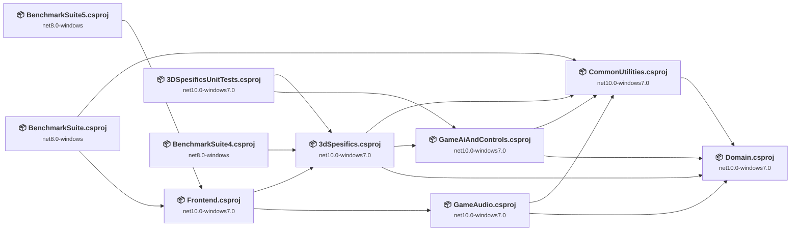

## Project Details

### 3dRotations\3dSpesifics.csproj

#### Project Info

- **Current Target Framework:** net10.0-windows7.0✅
- **SDK-style**: True
- **Project Kind:** Wpf
- **Dependencies**: 3
- **Dependants**: 3
- **Number of Files**: 29
- **Lines of Code**: 12239
- **Estimated LOC to modify**: 0+ (at least 0,0% of the project)

#### Dependency Graph

Legend:
📦 SDK-style project
⚙️ Classic project

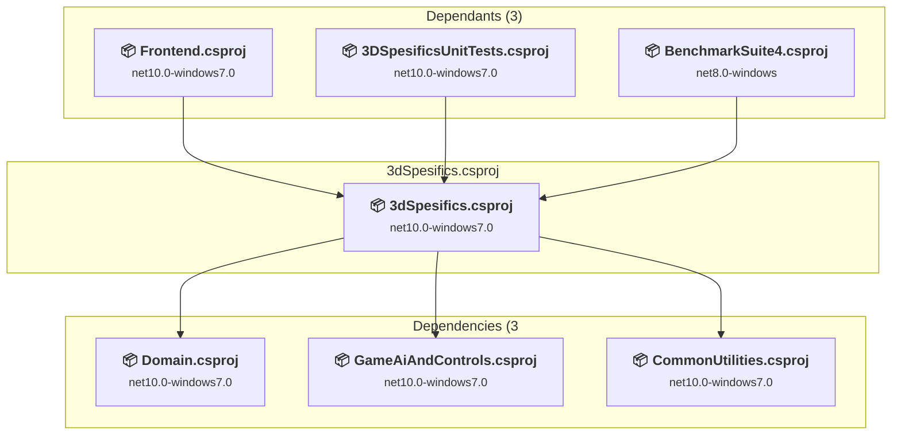

### API Compatibility

| Category | Count | Impact |
| :--- | :---: | :--- |
| 🔴 Binary Incompatible | 0 | High - Require code changes |
| 🟡 Source Incompatible | 0 | Medium - Needs re-compilation and potential conflicting API error fixing |
| 🔵 Behavioral change | 0 | Low - Behavioral changes that may require testing at runtime |
| ✅ Compatible | 0 |  |
| ***Total APIs Analyzed*** | ***0*** |  |

### 3DSpesificsUnitTests\3DSpesificsUnitTests.csproj

#### Project Info

- **Current Target Framework:** net10.0-windows7.0✅
- **SDK-style**: True
- **Project Kind:** DotNetCoreApp
- **Dependencies**: 2
- **Dependants**: 0
- **Number of Files**: 3
- **Lines of Code**: 1
- **Estimated LOC to modify**: 0+ (at least 0,0% of the project)

#### Dependency Graph

Legend:
📦 SDK-style project
⚙️ Classic project

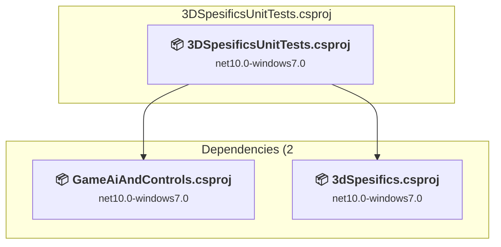

### API Compatibility

| Category | Count | Impact |
| :--- | :---: | :--- |
| 🔴 Binary Incompatible | 0 | High - Require code changes |
| 🟡 Source Incompatible | 0 | Medium - Needs re-compilation and potential conflicting API error fixing |
| 🔵 Behavioral change | 0 | Low - Behavioral changes that may require testing at runtime |
| ✅ Compatible | 0 |  |
| ***Total APIs Analyzed*** | ***0*** |  |

### 3dTesting\Frontend.csproj

#### Project Info

- **Current Target Framework:** net10.0-windows7.0✅
- **SDK-style**: True
- **Project Kind:** Wpf
- **Dependencies**: 2
- **Dependants**: 2
- **Number of Files**: 16
- **Lines of Code**: 3460
- **Estimated LOC to modify**: 0+ (at least 0,0% of the project)

#### Dependency Graph

Legend:
📦 SDK-style project
⚙️ Classic project

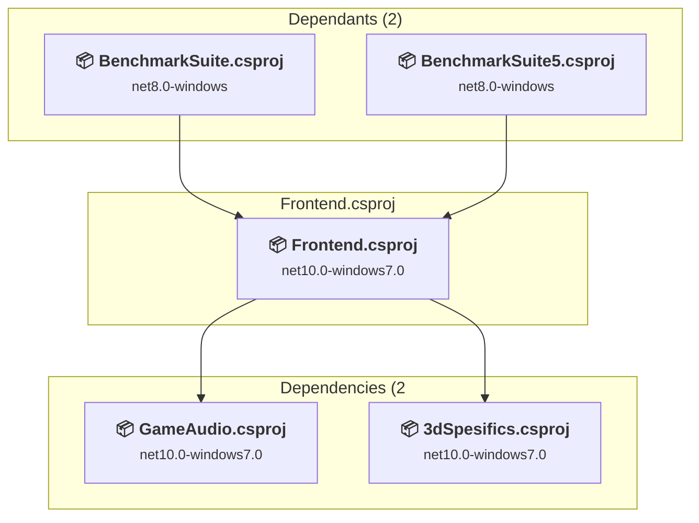

### API Compatibility

| Category | Count | Impact |
| :--- | :---: | :--- |
| 🔴 Binary Incompatible | 0 | High - Require code changes |
| 🟡 Source Incompatible | 0 | Medium - Needs re-compilation and potential conflicting API error fixing |
| 🔵 Behavioral change | 0 | Low - Behavioral changes that may require testing at runtime |
| ✅ Compatible | 0 |  |
| ***Total APIs Analyzed*** | ***0*** |  |

### BenchmarkSuite1\BenchmarkSuite.csproj

#### Project Info

- **Current Target Framework:** net8.0-windows
- **Proposed Target Framework:** net10.0--windows
- **SDK-style**: True
- **Project Kind:** DotNetCoreApp
- **Dependencies**: 2
- **Dependants**: 0
- **Number of Files**: 11
- **Number of Files with Incidents**: 1
- **Lines of Code**: 611
- **Estimated LOC to modify**: 0+ (at least 0,0% of the project)

#### Dependency Graph

Legend:
📦 SDK-style project
⚙️ Classic project

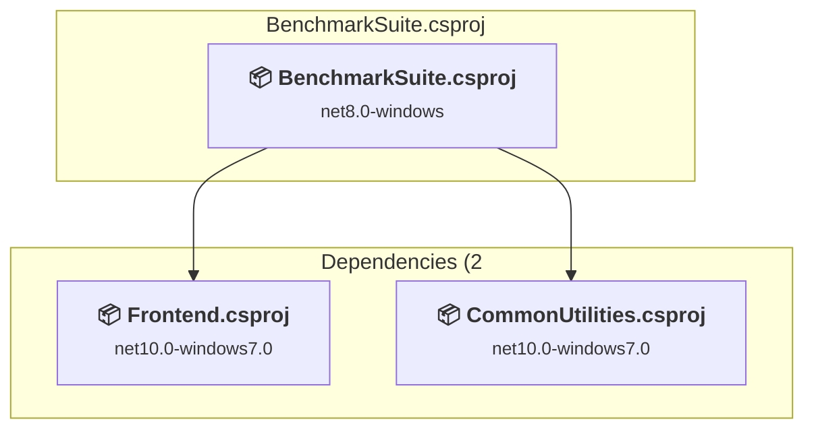

### API Compatibility

| Category | Count | Impact |
| :--- | :---: | :--- |
| 🔴 Binary Incompatible | 0 | High - Require code changes |
| 🟡 Source Incompatible | 0 | Medium - Needs re-compilation and potential conflicting API error fixing |
| 🔵 Behavioral change | 0 | Low - Behavioral changes that may require testing at runtime |
| ✅ Compatible | 492 |  |
| ***Total APIs Analyzed*** | ***492*** |  |

### BenchmarkSuite4\BenchmarkSuite4.csproj

#### Project Info

- **Current Target Framework:** net8.0-windows
- **Proposed Target Framework:** net10.0--windows
- **SDK-style**: True
- **Project Kind:** DotNetCoreApp
- **Dependencies**: 1
- **Dependants**: 0
- **Number of Files**: 3
- **Number of Files with Incidents**: 1
- **Lines of Code**: 281
- **Estimated LOC to modify**: 0+ (at least 0,0% of the project)

#### Dependency Graph

Legend:
📦 SDK-style project
⚙️ Classic project

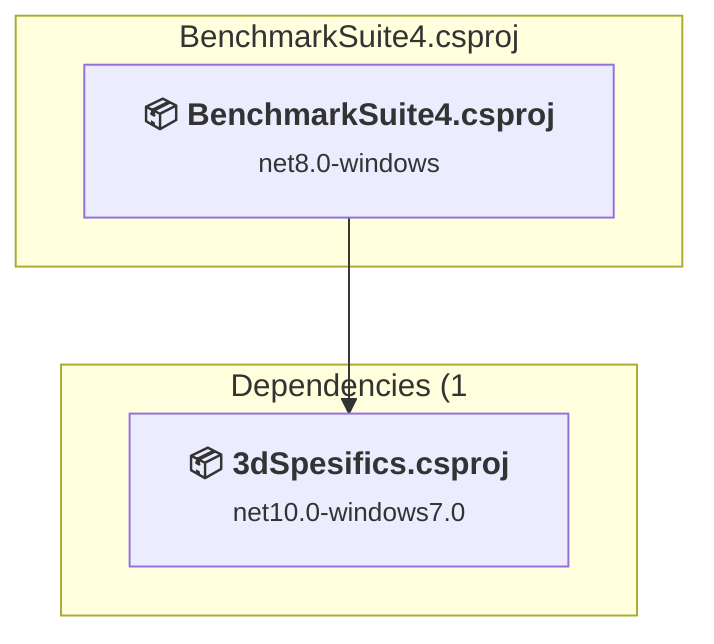

### API Compatibility

| Category | Count | Impact |
| :--- | :---: | :--- |
| 🔴 Binary Incompatible | 0 | High - Require code changes |
| 🟡 Source Incompatible | 0 | Medium - Needs re-compilation and potential conflicting API error fixing |
| 🔵 Behavioral change | 0 | Low - Behavioral changes that may require testing at runtime |
| ✅ Compatible | 301 |  |
| ***Total APIs Analyzed*** | ***301*** |  |

### BenchmarkSuite5\BenchmarkSuite5.csproj

#### Project Info

- **Current Target Framework:** net8.0-windows
- **Proposed Target Framework:** net10.0--windows
- **SDK-style**: True
- **Project Kind:** DotNetCoreApp
- **Dependencies**: 1
- **Dependants**: 0
- **Number of Files**: 3
- **Number of Files with Incidents**: 1
- **Lines of Code**: 335
- **Estimated LOC to modify**: 0+ (at least 0,0% of the project)

#### Dependency Graph

Legend:
📦 SDK-style project
⚙️ Classic project

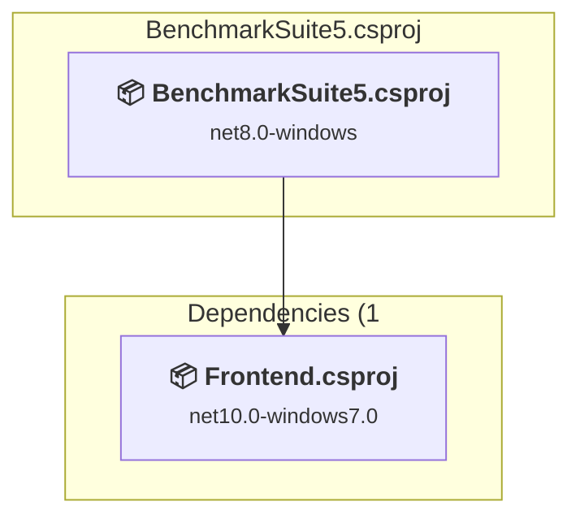

### API Compatibility

| Category | Count | Impact |
| :--- | :---: | :--- |
| 🔴 Binary Incompatible | 0 | High - Require code changes |
| 🟡 Source Incompatible | 0 | Medium - Needs re-compilation and potential conflicting API error fixing |
| 🔵 Behavioral change | 0 | Low - Behavioral changes that may require testing at runtime |
| ✅ Compatible | 320 |  |
| ***Total APIs Analyzed*** | ***320*** |  |

### CommonUtilities\CommonUtilities.csproj

#### Project Info

- **Current Target Framework:** net10.0-windows7.0✅
- **SDK-style**: True
- **Project Kind:** ClassLibrary
- **Dependencies**: 1
- **Dependants**: 4
- **Number of Files**: 23
- **Lines of Code**: 2776
- **Estimated LOC to modify**: 0+ (at least 0,0% of the project)

#### Dependency Graph

Legend:
📦 SDK-style project
⚙️ Classic project

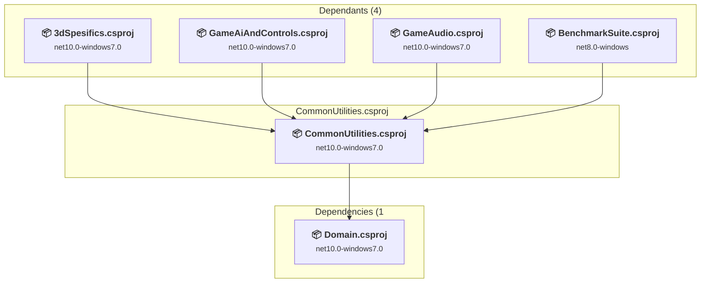

### API Compatibility

| Category | Count | Impact |
| :--- | :---: | :--- |
| 🔴 Binary Incompatible | 0 | High - Require code changes |
| 🟡 Source Incompatible | 0 | Medium - Needs re-compilation and potential conflicting API error fixing |
| 🔵 Behavioral change | 0 | Low - Behavioral changes that may require testing at runtime |
| ✅ Compatible | 0 |  |
| ***Total APIs Analyzed*** | ***0*** |  |

### Domain\Domain.csproj

#### Project Info

- **Current Target Framework:** net10.0-windows7.0✅
- **SDK-style**: True
- **Project Kind:** Wpf
- **Dependencies**: 0
- **Dependants**: 4
- **Number of Files**: 29
- **Lines of Code**: 916
- **Estimated LOC to modify**: 0+ (at least 0,0% of the project)

#### Dependency Graph

Legend:
📦 SDK-style project
⚙️ Classic project

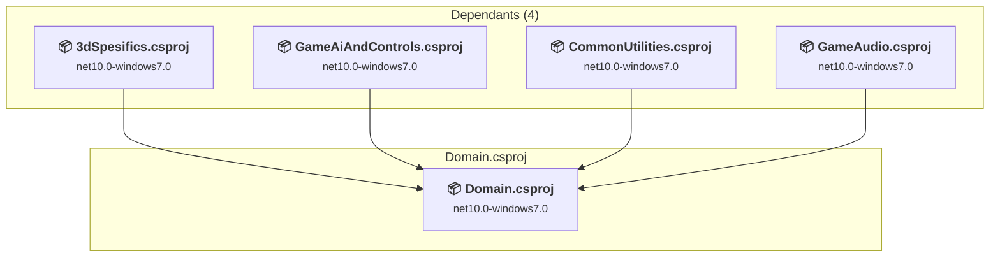

### API Compatibility

| Category | Count | Impact |
| :--- | :---: | :--- |
| 🔴 Binary Incompatible | 0 | High - Require code changes |
| 🟡 Source Incompatible | 0 | Medium - Needs re-compilation and potential conflicting API error fixing |
| 🔵 Behavioral change | 0 | Low - Behavioral changes that may require testing at runtime |
| ✅ Compatible | 0 |  |
| ***Total APIs Analyzed*** | ***0*** |  |

### GameAi\GameAiAndControls.csproj

#### Project Info

- **Current Target Framework:** net10.0-windows7.0✅
- **SDK-style**: True
- **Project Kind:** Wpf
- **Dependencies**: 2
- **Dependants**: 2
- **Number of Files**: 18
- **Lines of Code**: 5644
- **Estimated LOC to modify**: 0+ (at least 0,0% of the project)

#### Dependency Graph

Legend:
📦 SDK-style project
⚙️ Classic project

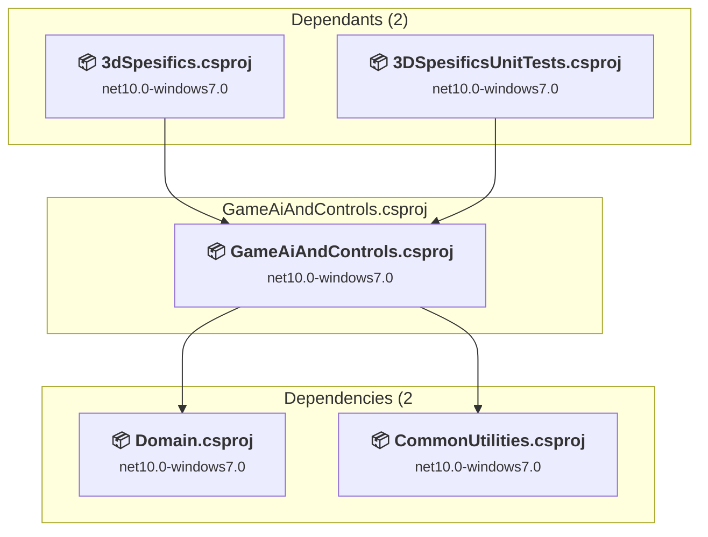

### API Compatibility

| Category | Count | Impact |
| :--- | :---: | :--- |
| 🔴 Binary Incompatible | 0 | High - Require code changes |
| 🟡 Source Incompatible | 0 | Medium - Needs re-compilation and potential conflicting API error fixing |
| 🔵 Behavioral change | 0 | Low - Behavioral changes that may require testing at runtime |
| ✅ Compatible | 0 |  |
| ***Total APIs Analyzed*** | ***0*** |  |

### GameAudio\GameAudio.csproj

#### Project Info

- **Current Target Framework:** net10.0-windows7.0✅
- **SDK-style**: True
- **Project Kind:** ClassLibrary
- **Dependencies**: 2
- **Dependants**: 1
- **Number of Files**: 5
- **Lines of Code**: 678
- **Estimated LOC to modify**: 0+ (at least 0,0% of the project)

#### Dependency Graph

Legend:
📦 SDK-style project
⚙️ Classic project

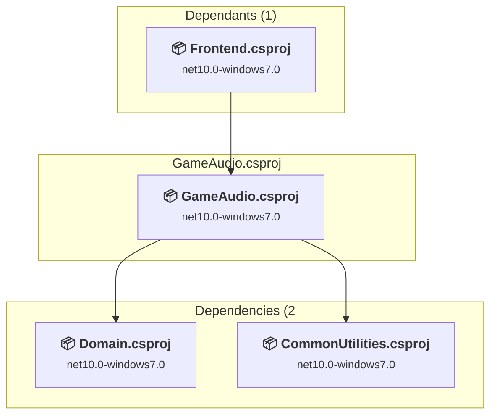

### API Compatibility

| Category | Count | Impact |
| :--- | :---: | :--- |
| 🔴 Binary Incompatible | 0 | High - Require code changes |
| 🟡 Source Incompatible | 0 | Medium - Needs re-compilation and potential conflicting API error fixing |
| 🔵 Behavioral change | 0 | Low - Behavioral changes that may require testing at runtime |
| ✅ Compatible | 0 |  |
| ***Total APIs Analyzed*** | ***0*** |  |

